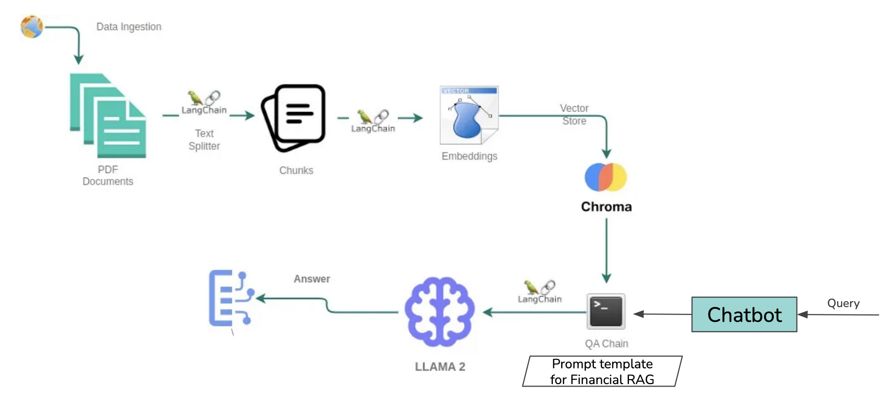

# AI Financial Insights Chatbot

AI Chatbot for Financial Reports (10Q, 10K) is a Retrieval-Augmented Generation (RAG) system designed to provide financial insights by processing user queries on financial documents, such as Tesla's 10Q and 10K reports. The chatbot leverages cutting-edge NLP models like GPT, LLAMA2, and Flan-T5, integrated into a seamless interactive interface.


### Download:
[Download the Demo Video](./assets/Demo.mp4)


## Problem statement: 
Given a PDF document and a query, retrieve the relevant details and information from the document as per the query, and synthesize this information to generate accurate answers.

The chatbot uses the following architecture for efficient query processing and response generation:

### Key Steps in the Architecture
1. **Data Ingestion**: Load financial PDF documents into the system.
2. **Text Splitting**: Use LangChain’s `RecursiveCharacterTextSplitter` to split documents into smaller, manageable chunks.
3. **Embeddings**: Generate vector embeddings using HuggingFace to represent the chunks numerically.
4. **Vector Store**: Store chunks and their embeddings in ChromaDB for quick similarity-based retrieval.
5. **Query Processing**: Retrieve the most relevant document chunks based on user queries.
6. **Language Model Processing**: Use models like GPT, LLAMA2, or Flan-T5 to generate accurate and context-aware responses.
7. **Chatbot UI**: Display user queries and responses in an intuitive chatbot interface.

## Project Structure

The project is organized as follows:
```
project-root/
│
├── assets/              # UI assets like CSS and images
│   └── style.css        # Optional: Custom styles
│
├── components/          # Reusable UI components
│   ├── input.py         # Chat input field
│   ├── navbar.py        # Navigation bar
│   └── textbox.py       # Chat bubbles for messages
│
├── data/                # Data files
│   └── tsla-20230930.pdf # Financial report for chatbot processing
│
├── pages/               # Page-specific logic
│   ├── page_not_found.py
│   └── chatbot/
│       ├── chatbot_controller.py
│       ├── chatbot_model.py
│       └── chatbot_view.py
│
├── .env                 # API keys and environment variables
├── app.py               # Main application initialization
├── index.py             # Routing logic for the app
├── requirements.txt     # Dependencies
├── Dockerfile           # Containerization file
├── docker-compose.yml   # Optional: Docker Compose configuration
└── README.md            # Project documentation
```

## System architecture



## Features

### Multi-Model Support:
- Choose between GPT, LLAMA2, and Flan-T5 models.

### LLMs and Experiments

1. GPT-3.5
2. LLama 2
3. Gemma 1.1
4. Flan-T5


## Evaluation

Metrics:
* **Generation Metrics:** Faithfulness and Answer Relevancy.
* **Retrieval:** Context Recall and Context Precision.

Description:
* **Faithfulness:** This measures the factual consistency of the generated answer against the given context. The generated answer is regarded as faithful if all the claims that are made in the answer can be inferred from the given context. 
* **Answer relevancy:** Scores the relevancy of the answer according to the given question. Answers with incomplete, redundant or unnecessary information is penalized.
* **Context recall:** measures the extent to which the retrieved context aligns with the annotated answer, treated as the ground truth.
* **Context precision:** evaluates whether all of the ground-truth relevant items present in the contexts are ranked higher or not.


### Financial RAG Pipeline:
- Retrieves relevant document chunks and provides accurate responses using a Retrieval-Augmented Generation approach.

### Interactive Chatbot Interface:
- Built with Dash and Bootstrap for a clean, responsive, and user-friendly experience.

### Efficient Document Embeddings:
- Employs HuggingFace embeddings and ChromaDB for fast vector-based search and retrieval.

### Dockerized Deployment:
- Fully containerized for seamless deployment on any system.

## Setup and Installation

### Prerequisites
- Python 3.8+
- Docker (for containerization)
- OpenAI API key (or other supported model keys)

### Installation Steps
1. Clone the repository:
   ```bash
   git clone https://github.com/RobuRishabh/Financial-Insights-Chatbot-Leveraging-Retrieval-Augmented-Generation-for-10Q-and-10K-Reports.git
   ```
2. Install dependencies:
   ```bash
   pip install -r requirements.txt
   ```
3. Add your API key to the `.env` file:
   ```makefile
   OPENAI_API_KEY=your-api-key
   ```
4. Start the application:
   ```bash
   python index.py
   ```
5. Open your browser and navigate to:
   ```
   http://127.0.0.1:8050
   ```

### Containerization

#### Build the Docker Image
1. Build the Docker image:
   ```bash
   docker build -t rag-chatbot-app .
   ```
2. Run the Docker container:
   ```bash
   docker run -d -p 8050:8050 --env-file .env --name chatbot-container rag-chatbot-app
   ```
3. Access the application:
   ```
   http://127.0.0.1:8050
   ```

## Key Components

### Chatbot UI
- Built using Dash and Dash Bootstrap Components.
- Includes dynamic conversation updates, model selection, and user-friendly interaction.

### Retrieval-Augmented Generation (RAG)
- Combines document retrieval with advanced language models for generating concise and accurate responses.

### Embedding and Storage
- ChromaDB is used for embedding storage, enabling fast retrieval of relevant document chunks.

## Acknowledgements
This project is powered by:
- LangChain
- HuggingFace
- ChromaDB
- OpenAI for GPT-3.5-turbo.

## License
This project is licensed under the MIT License. See the LICENSE file for more details.
